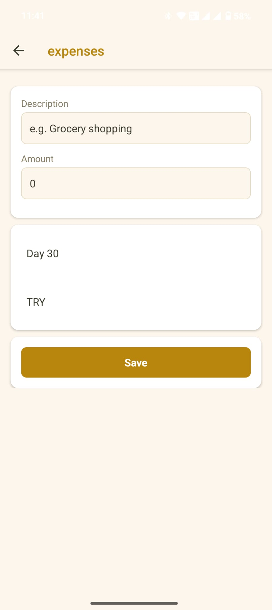
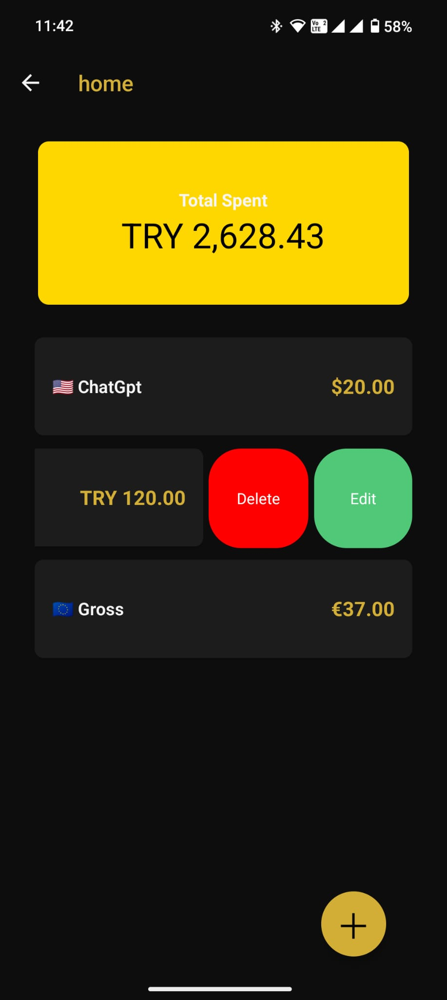
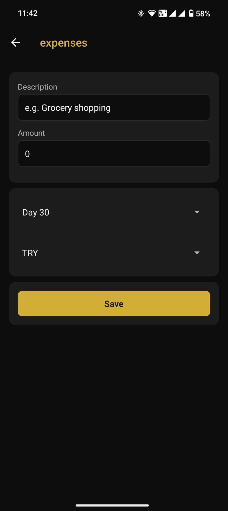
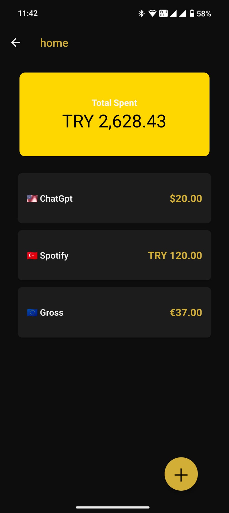

# 💰 ExpensesApp

[Download For Android](https://expo.dev/accounts/roseprince/projects/Balance/builds/b7c2e4f7-3444-477f-bff2-ef9ca4a1a23f)

**ExpensesApp** is a cross-platform React Native application built with Expo. It helps users track daily expenses with features like currency conversion, theme switching, and local storage.

## ✨ Features

- 📌 Add, edit, and delete expense records
- 🌐 Currency support with live exchange rates (USD, EUR, TRY)
- 🎨 Light/Dark theme toggle
- 💾 Local data persistence with AsyncStorage
- 📆 Date selection via picker
- 🔔 (Optional) Notification toggle
- 📱 Fully responsive UI for iOS, Android, and Web

## 🛠️ Built With

- [React Native](https://reactnative.dev/)
- [Expo](https://expo.dev/)
- [TypeScript](https://www.typescriptlang.org/)
- [AsyncStorage](https://github.com/react-native-async-storage/async-storage)
- [Expo Router](https://expo.github.io/router/)
- [Expo Localization](https://docs.expo.dev/versions/latest/sdk/localization/)
- [React Native Gesture Handler](https://docs.swmansion.com/react-native-gesture-handler/)
- [React Native Picker](https://github.com/react-native-picker/picker)

## 📷 Screenshots

### Light Theme





### Dark Theme





## 🚀 Getting Started

### Prerequisites

- Node.js >= 18
- Expo CLI installed globally:
  ```bash
  npm install -g expo-cli
  ```

### Installation

```bash
git clone https://github.com/HDemir23/ExpensesApp.git
cd ExpensesApp
npm install
```

### Running the App

```bash
npm start
```

To run on device/emulator:

- Press `i` for iOS Simulator
- Press `a` for Android Emulator
- Scan QR code using Expo Go on your device

---

## 📦 Build

To generate APK or iOS builds with EAS:

```bash
npx eas build -p android
npx eas build -p ios
```

> Make sure you have `eas-cli` installed and your project is configured:

```bash
npm install -g eas-cli
npx eas build:configure
```

---

## 📁 Folder Structure

```txt
.
├── components/          # UI components (AddExpenseButton, ExpenseCard, etc.)
├── constants/           # Theme and configuration files
├── hooks/               # Custom hooks (useExpenses, useSaveExpenses)
├── utils/               # Utility functions (currency conversion, formatting)
├── assets/              # Icons and splash images
├── app/                 # App routes and entry points
├── types/               # Type definitions (ExpenseType, RatesType)
```

---

## 🧪 To Do

- [ ] Add cloud sync / authentication
- [ ] Add charts / analytics
- [ ] Add push notifications
- [ ] Export data as CSV

---

## 📄 License

MIT License © 2025 [@HDemir23](https://github.com/HDemir23)

---

## 🙌 Acknowledgements

Thanks to open-source tools and Expo ecosystem for making development smooth across platforms.
